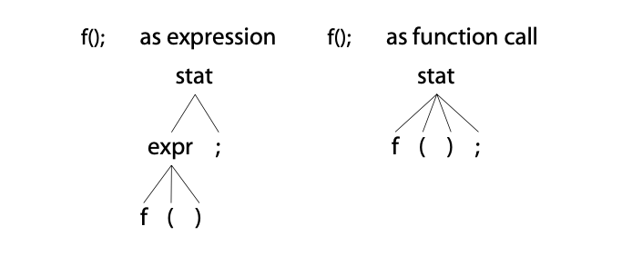

# The Big Picture

## Let's Get Meta!

To implement a language, we have to build an application that reads sentences and reacts appropriately to the phrases and input symbols it discovers. (A **language** is a set of valid **sentences**, a sentence is made up of **phrases**, and a phrase is made up of **subphrases** and **vocabulary symbols**.)

Broadly speaking, if an application computes or “executes” sentences, we call that application an ***interpreter***. Examples include calculators, configuration file readers, and Python interpreters. If we’re converting sentences from one language to another, we call that application a ***translator***. Examples include Java to C# converters and compilers.

To react appropriately, the ***interpreter*** or ***translator*** has to recognize all of the valid sentences, phrases, and subphrases of a particular language. **Recognizing a phrase means we can identify the various components and can differentiate it from other phrases**.

Programs that recognize languages are called ***parsers*** or *syntax analyzers*. *Syntax* refers to the rules governing language membership, and we're going to build ANTLR *grammars* to specify language syntax. A ***grammar*** is just a set of rules, each one expressing the structure of a phrase. The ANTLR translates grammars to parsers. And grammars themselves follow the syntax of a language optimized for specifying other languages: ANTLR's *meta-language*.

Parsing is much easier if we break it down into two similar but distinct tasks or stages. The separate stages mirror how our brains read English text. We don’t read a sentence character by character. Instead, we perceive a sentence as a stream of words. The human brain subconsciously groups character sequences into words and looks them up in a dictionary before recognizing grammatical structure. This process is more obvious if we’re reading Morse code because we have to convert the dots and dashes to characters before reading a message.

The fisrt stage is the process of **grouping characters into words or symbols (tokens)** called *lexical analysis* or simply *tokenizing*. We call a program that tokenizes the input a ***lexer***. The lexer can group related tokens into token classes or ***token types***, such as INT, ID, FLOAT and so on. The lexer groups vocabulary symbols into types when the parser cares only about the type, not the individual symbols. Tokens consist of at least two pieces of information: the token type (identifying the lexical structure) and the text matched for that token by the lexer.

The second stage is the actual parser and **feeds off to these tokens to recognize the sentence structure**. By default, ANTLR-generated parsers build a data structure called a *parse tree* or *syntax tree* that records how the parser recognized the structure of the input sentence and its component phrases.

The following digram illustrates the basic data flow of a language recognizer:


The interior nodes of the parse tree are phrase names (grammar rule names) that group and identify their children. The root node is the most abstract phrase name, in this case stat (short for “statement”). The leaf nodes of a parse tree are always the input tokens.

By producing a parse tree, a parser delivers a handy data structure to the rest of the application that contains complete information about how the parser grouped the symbols into phrases. Trees are easy to process in subsequent steps and are well understood by programmers. Better yet, the parser can generate parse trees automatically.

## Implementing Parsers

Understanding how ANTLR translates rules into human-readable parsing code is fundamental to using and debugging grammars, so let's dig deeper into how parsing works.

The ANTLR tool generates *recursive-descent* parsers from grammar rules. Recursive-descent parsers are really just a collection of *recursive* methods, one per rule. The *descent* term refers to the fact that parsing begins at the root of a parse tree and proceeds toward the leaves (tokens). The rule we invoke first, the *start symbol*, becomes the root of the parse tree. A more general term for this kind of parsing is *top-down parsing*; recursive-descent parsers are just one kind of top-down parser implementation.

To get an idea of what recursive-descent parsers look like, here's the (slightly cleaned up) method that ANTLR generates for rule `assign`:
```java
// assign : ID '=' expr ';' ;
void assign() {
  match(ID);
  match('=');
  expr();
  match(';');
}
```

The cool part about recursive-descent parsers is that the call graph traced out by invoking methods `stat()`, `assign()` and `expr()` mirrors the interior parse tree nodes. The calls to `match()` correspond to the parse tree leaves.

Method `assign()` just checks to make sure all necessary tokens and present and in the right order. When the parser enters `assign()`, it doesn't have to choose between more than one *alternative*. An alternative is one of the choices on the right side of a rule definition. For example, the `stat` rule that invokes `assign` likely has a list of other kinds of statement.
```
/** Match any kind of statement starting at the current input position */
stat : assign // First alternative ('|' is alternative separator)
     | ifstat // Second alternative
     | whilestat
     ...
     ;
```

A parsing rule for `stat` looks like a `switch`.
```java
void stat() {
    switch (CURRENT_INPUT_TOKEN) {
        case ID: assign(); break;
        case IF: ifstat(); break;
        case WHILE: whilestat(); break;
        ...
        default: RAISE NO VIABLE ALTERNATIVE EXCEPTION
    }
}
```

Method `stat()` has to make a *parsing decision* or *prediction* by examining the next input token. Parsing decisions predict which alternative will be successful.

The next input token is also called *lookahead token*. A lookahead token is any token that the parser sniffs before matching and consuming it.

Sometimes, the parser needs lots of lookahead tokens to predict which alternative will succeed. It might even have to consider all tokens from the current position until the end of file! ANTLR silently handles all of this for you, but it's helpful to have a basic understanding of decision making so debugging generated parsers is easier.

To visualize parsing decisions, imagine a maze with a single entrance and a single exit that has words written on the floor. Every sequence of words along a path from entrance to exit represents a sentence. The structure of the maze is analogous to the rules in a grammar that define a language. To test a sentence for membership in a language, we compare the sentence’s words with the words along the floor as we traverse the maze. If we can get to the exit by following the sentence’s words, that sentence is valid.

To navigate the maze, we must choose a valid path at each fork, just as we must choose alternatives in a parser. We have to decide which path to take by comparing the next word or words in our sentence with the words visible down each path emanating from the fork. The words we can see from the fork are analogous to lookahead tokens. The decision is pretty easy when each path starts with a unique word. In rule stat, each alternative begins with a unique token, so `stat()` can distinguish the alternatives by looking at the first lookahead token.

When the words starting each path from a fork overlap, a parser needs to look further ahead, scanning for words that distinguish the alternatives. ANTLR automatically throttles the amount of lookahead up-and-down as necessary for each decision. If the lookahead is the same down multiple paths to the exit (end of file), there are multiple interpretations of the current input phrase. Resolving such ambiguities is our next topic. After that, we’ll figure out how to use parse trees to build language applications.

## You Can't Put Too Much Water into a Nuclear Reactor

An ambiguous phrase or sentence is one that has more than one interpretation. In other words, the words fit more than one grammatical structure.

Ambiguity can be funny in natural language but causes problems for computer-based language applications. To interpret or translate a phrase, a program has to uniquely identify the meaning. That means we have to provide unambiguous grammars so that the generated parser can match each input phrase in exactly one way.

We haven't studied grammars in detail yet, but let's include a few ambiguous grammars hear to make the notion of ambiguity more concrete.

Some ambiguous grammars are obvious.
```
stat : ID '=' expr ';' // match an assignment; can match "f();"
     | ID '=' expr ';' // oops! an exact duplicate of previous alternative
     ;
expr : INT ;
```

Most of the time the ambiguity will be more subtle, as in the following grammar that can match a function call via both alternatives of rule `stat`:
```
stat : expr ';'       // expression statement
     | ID '(' ')' ';' // function call statement
     ;
expr : ID '(' ')'
     | INT
     ;
```

Here are the two interpretations of input `f()`; starting in rule `stat`:


The parse tree on the left shows the case where `f()` matches to the rule `expr`. The tree on the right shows `f()` matching to the second alternative of the rule `stat`.

Since most language inventors design their syntax to be unambiguous, an ambiguous grammar is analogous to a programming bug. We need to reorganize the grammar to present a single choice to the parser for each input phrase. If the parser detects an ambiguous phrase, it has to pick one of the viable alternatives. ANTLR resolves the ambiguity by **choosing the first alternative** involved in the decision. In this case, the parser would choose the interpretation of `f()`; associated with the parse tree on the left.

Ambiguities can occur in the lexer as well as the parser, but ANTLR resolves them so the rules behave naturally. ANTLR resolves lexical ambiguities by **matching the input string to the rule specified first** in the grammar. To see how this works, let's look at an ambiguity that's common to most programming languages: the anbiguity between keywords and identifier rules. Keyword `begin` (followed by a nonletter) is also an identifier, at least lexically, so the lexer can match b-e-g-i-n to either rule.
```
BEGIN : 'begin' ; // match b-e-g-i-n sequence; ambiguity resolves to BEGIN
ID : [a-z]+ ; // match one or more of any lowercase letter
```

For more on this lexical ambiguity, see [Matching Identifiers](05.Designing%20Grammars.md#Matching%20Identifiers).

Note that **lexers try to match the longest string possible for each token**, meaning that input `beginner` would match only to rule `ID`. The lexer would not match `beginner` as `BEGIN` followed by an `ID` matching input `ner`.

Sometimes the syntax for a language is just plain ambiguous and no amount of grammar reorganization will change that fact. For example, the natural grammar for arithmetic expressions can interpret input such as 1+2*3 in two ways, either by performing the operations left to right (as Smalltalk does) or in precedence order like most languages. We’ll learn how to implicitly specify the operator precedence order for expressions in [Dealing with Precedence, Left Recursion, and Associativity](05.Designing%20Grammars.md#Dealing%20with%20Precedence%2C%20Left%20Recursion%2C%20and%20Associativity).

The venerable C language exhibits another kind of ambiguity, which we can resolve using context information such as how an identifier is defined. Con- sider the code snippet `i*j;`. Syntactically, it looks like an expression, but its meaning, or semantics, depends on whether `i` is a type name or variable. If `i` is a type name, then the snippet isn’t an expression. It’s a declaration of variable `j` as a pointer to type `i`. We’ll see how to resolve these ambiguities in [Altering the Parse with Semantic Predicates](11.Altering%20the%20Parse%20with%20Semantic%20Predicates.md)

## Building Language Applications Using Parse Trees

To make a language application, we have to execute some appropriate code for each input phrase or subphrase. The easiest way to do that is to operate on the parse tree created automatically by the parser. The nice thing about operating on the tree is that we’re back in familiar programming language territory. There’s no further ANTLR syntax to learn in order to build an application.

Earlier we learned that lexers process characters and pass tokens to the parser, which in turn checks syntax and creates a parse tree. The corresponding ANTLR classes are `CharStream`, `Lexer`, `Token`, `Parser`, and `ParseTree`. The "pip" connecting the lexer and parser is called a `TokenStream`. The diagram below illustrates how objects of these types connect to each other in memory.


These ANTLR data structures **share as much data as possible to reduce memory requirements**. The diagram shows that leaf (token) nodes in the parse tree are containers that point at tokens in the token stream. The tokens record start and stop character indexes into the CharStream, rather than making copies of substrings. There are no tokes associated with whitespace characters (indexes 2 and 4) since we can assume our lexer tosses out whitespace.

The figure also shows ParseTree subclasses `RuleNode` and `TerminalNode` that correspond to subtree roots and leaf nodes. `RuleNode` has familiar methods such as `getChild()` and `getParent()`, but `RuleNode` isn’t specific to a particular grammar. To better support access to the elements within specific nodes, ANTLR generates a `RuleNode` subclass for each rule. The following figure shows the specific classes of the subtree roots for our assignment statement example, which are `StatContext`, `AssignContext`, and `ExprContext`:


These are called *context* objects because they record everything we know about the recognition of a phrase by a rule. Each context object knows the start and stop tokens for the recognized phrase and provides access to all of the elements of that phrase. For example, `AssignContext` provides methods `ID()` and `expr()` to access the identifier node and expression subtree.

Given this description of the concrete types, we could write code by hand to perform a depth-first walk of the tree. We could perform whatever actions we wanted as we discovered and finished nodes. Typical operations are things such as computing results, updating data structures, or generating output. Rather than writing the same tree-walking boilerplate code over again for each application, though, we can use the tree-walking mechanisms that ANTLR generates automatically.

## Parse-Tree Listeners and Visitors

ANTLR provides support for two tree-walking mechanisms in its runtime library. By default, ANTLR generates a parse-tree *listener* interface that responds to events triggered by the built-in tree walker. The listeners thenselves are exactly like SAX document handler objects for XML parsers. SAX listeners receive notification of events like `startDocument()` and `endDocument()`. The methods in a listener are just callbacks, such as we'd use to respond to a checkbox click in a GUI application. Once we look at listeners, we'll see how ANTLR can also generate tree walkers that follow the visitor design pattern.

### Parse-Tree Listeners

To walk a tree and trigger calls into a listener, ANTLR’s runtime provides class `ParseTreeWalker`. To make a language application, we build a `ParseTreeListener` implementation containing application-specific code that typically calls into a larger surrounding application.

ANTLR generates a `ParseTreeListener` subclass specific to each grammar with `enter` and `exit` methods for each rule. As the walker encounters the node for rule `assign`, for example, it triggers `enterAssign()` and passes it the `AssignContext` parse-tree node. After the walker visits all children of the assign node, it triggers `exitAssign()`. The tree diagram shown below shows `ParseTreeWalker` performing a depth-first walk, represented by the thick dashed line.


The beauty of the listener mechanism is that it’s all automatic. We don’t have to write a parse-tree walker, and our listener methods don’t have to explicitly visit their children.


### Parse-Tree Visitors

There are situations, however, where we want to control the walk itself, explicitly calling methods to visit children. Option `-visitor` asks ANTLR to generate a visitor interface from a grammar with a visit method per rule. Here’s the familiar visitor pattern operating on our parse tree:


The thick dashed line shows a depth-first walk of the parse tree. The thin dashed lines indicate the method call sequence among the visitor methods. To initiate a walk of the tree, our application-specific code would create a visitor implementation and call `visit()`.
```Java
ParseTree tree = ... ; // tree is result of parsing
MyVisitor v = new MyVisitor();
v.visit(tree);
```

ANTLR’s visitor support code would then call `visitStat()` upon seeing the root node. From there, the `visitStat()` implementation would call `visit()` with the children as arguments to continue the walk. Or, `visitMethod()` could explicitly call `visitAssign()`, and so on.

ANTLR gives us a leg up over writing everything ourselves by generating the visitor interface and providing a class with default implementations for the visitor methods. This way, we avoid having to override every method in the interface, letting us focus on just the methods of interest.

## Parsing Terms

This chapter introduced a number of important language recognition terms.
- ***Language***: A language is a set of valid sentences; sentences are composed of phrases, which are composed of subphrases, and so on.
- ***Grammar***: A grammar formally defines the syntax rules of a language. Each rule in a grammar expresses the structure of a subphrase.
- ***Syntax tree*** or ***parse tree***: This represents the structure of the sentence where each subtree root gives an abstract name to the elements beneath it. The subtree roots correspond to grammar rule names. The leaves of the tree are symbols or tokens of the sentence.
- ***Token***: A token is a vocabulary symbol in a language; these can represent a category of symbols such as “identifier” or can represent a single operator or keyword.
- ***Lexer*** or ***tokenizer***: This breaks up an input character stream into tokens. A lexer performs lexical analysis.
- ***Parser***: A parser checks sentences for membership in a specific language by checking the sentence’s structure against the rules of a grammar. The best analogy for parsing is traversing a maze, comparing words of a sentence to words written along the floor to go from entrance to exit. ANTLR generates top-down parsers called ALL(*) that can use all remaining input symbols to make decisions. Top-down parsers are goal-oriented and start matching at the rule associated with the coarsest construct, such as `program` or `inputFile`.
- ***Recursive-descent parser***: This is a specific kind of top-down parser implemented with a function for each rule in the grammar.
- ***Lookahead***: Parsers use lookahead to make decisions by comparing the symbols that begin each alternative.
